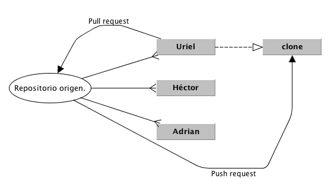

# Guía para colaborar mediante GitHub

## 1.- Haz un fork del repositorio original
Para hacer un fork, inicia sesión en [GitHub](http://github.com/login "Inicia sesión en GitHub") y dirígite al repositorio de tu interés. Una vez allí, presiona el botón "Fork".

Ahora tendrás una copia del repositorio de tu interés en tu cuenta.

## 2.- Clona el fork a tu máquina de trabajo.
Para hacer esto abre una terminal y posiciónate en el directorio donde estará el proyecto. Luego, escribe el siguiente comando:

    $ git clone https://github.com/{username}/{repositorio}.git

Donde _{username}_ es tu nombre de usuario en GitHub y _{repositorio}_ es el nombre del repositorio.

**Nota**: asegúrate de instalar las dependencias necesarias para el proyecto.

Para una aplicación _Ruby on Rails_, basta con entrar al proyecto por línea de comandos y ejecutar las siguientes sentencias:

    $ bundle install
    $ rails server

## 3.- Flujo de trabajo
Primero, un par de conceptos:

* **Trunk o *master***: la ubicación principal del código en el repositorio. Si se tratara de un árbol, sería el tronco principal.
* ***Branch* o rama**: es un "espacio paralelo" dentro del sistema de control de versiones donde estarás trabajando con las nuevas funcionalidades. Puedes imaginarlo como una copia del proyecto para uso privado: corregir errores, hacer pruebas, experimentos, etcétera.
* **Commit**: confirmación de un cambio en un archivo. El archivo obtiene un número de commit, pero todo ocurre de manera local. **No** se sube el archivo a ninguna parte.
* **Repositorio remoto**: un repositorio en tu máquina o en la de alguien más que está sincronizado con el tuyo, de algún modo. El repositorio remoto por default se llama *origin* y corresponde al repositorio en la máquina del cual clonaste el proyecto.

### Crear un nuevo branch
    $ git checkout -b *nombre_de_tu_branch*

### Crear un commit (flujo completo)
    $ git status     # (ves los archivos modificados)
    $ git diff       # (ves el contenido de los archivos modificados)
    $ git checkout -- /path/al/archivo # (descartas la modificación)
    $ git add .      # (confirmas los archivos que se consignarán)
    $ git commit     #para consignar
    $ git log        #para revisar el historial
    
    
Para aplicar los cambios de una rama a otra, ¡fusiona! Por ejemplo, puedes fusionar funcionalidad de una rama a otra, así:

    Para cambiarte al branch master:
      $ git checkout master
    Para llevar los cambios del branch planes_malvados al branch master:
      $ git merge planes_malvados 

## 4.- Compartiendo cambios
* **Push**: cuando envias un cambio a otro repositorio.
* **Pull**: cuando descargas los cambios desde otro repositorio hacia el tuyo.

Para compartir tus cambios con alguien más, primero debes subir los cambios de tu repositorio local a tu repositorio alojado en GitHub.

    $ git push origin master
    
Para que la otra persona integre tus cambios en su repositorio, debes solicitárselo mediante una característica de GitHub conocida como **Pull Request**.

## 5.- Mantente al día

Cuando el autor del repositorio haya aceptado y fusionado tus cambios, o los de otras personas, ¡puedes actualizar tu repositorio local y seguir hackeando en las cosas nuevas del proyecto!

Para actualizarte, debes tener configurado el repositorio original como repositorio remoto, en tu proyecto local. Si todavía no lo has configurado, usa este simple comando:

    $ git remote add originhub https://github.com/edmt/chirakiru_blog.git
    
**Nota**: ahora tu repositorio local estará conectado a 2 repositorios remotos: el que está en tu cuenta en GitHub y éste.
    
Finalmente, para descargar todos los cambios, siempre y cuando te encuentres en el branch master:

    $ git branch   # debe imprimir "master"
    $ git pull originhub master

### Créditos
* Daniel Martínez ([@dtumbolia](http://twitter.com/dtumbolia "Ver perfil"))
* Uriel Molina ([@urielable](http://twitter.com/urielable "Ver perfil"))

Copyleft

    &copy;

2013

